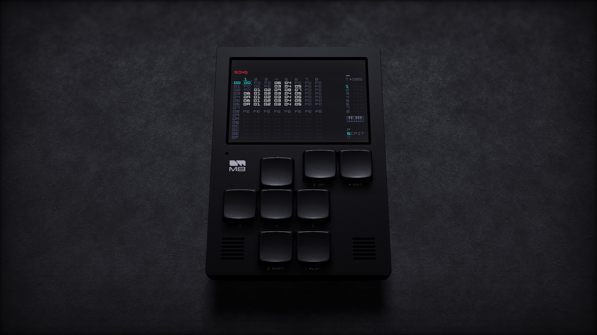

# m8gd: M8 Headless Display and Visualizer

## Description

m8gd is a M8 headless client that is capable of rendering the M8's display in a 3D environment using the Godot Engine.

This repository consists of the C++ library and GDExtension `libm8gd` that acts as a headless M8 client library, and the Godot project `m8gd` as the frontend.

## Building from source

### Requirements

- Git
- GCC (if on Windows/Linux) or Clang (if on macOS)
- Homebrew or MacPorts (if on macOS)
- Python 3.6+
- Scons (`python -m pip install scons`)
- pkg-config
- libserialport
- [Godot 4.3-stable](https://godotengine.org/download/archive/4.3-stable/)
- a desktop environment

If on Windows, a MSYS2/MinGW64 installation is recommended when compiling.

### Installing requirements

#### Windows (via MinGW64)

```bash
$ pacman -S git pkg-conf python python-pip base-devel mingw-w64-x86_64-gcc mingw-w64-x86_64-libserialport
$ python -m pip install scons
```

#### Linux (Arch Linux)

```bash
$ sudo pacman -S git pkg-conf python python-pip base-devel gcc libserialport
$ python -m pip install scons
```

#### MacOS

```bash
# with Homebrew
$ brew install scons
$ brew install libserialport

# with MacPorts
$ macports install scons
$ macports install libserialport
```

### Building

#### 1. Clone and enter this repo
```bash
$ git clone https://github.com/octoocto/m8gd
$ cd m8gd
$ git submodule update --init
```

#### 2. Compile the GDExtension libm8gd
```bash
$ scons target=template_release

# or, specify a platform ("windows", "linux", or "macos")
$ scons target=template_release platform=<platform>
```
##### Compiling for Windows (via MinGW64)
```bash
# specifying platform is required here
$ scons target=template_release platform=windows
```

__If you want to be able to edit the project in the Godot Editor as well__,
compiling the debug version of libm8gd is required:
```bash
$ scons target=template_debug platform=<platform>
```

#### 3. Download and Install the export templates for Godot

##### A. Download and Installing with the Godot Editor UI

Run `godot` to open the Project Manager UI.

Click the "Import" button at the top-left of the window, select the project file located in `project/project.godot`, then click "Open" to open the editor.

In the editor, click "Editor" at the top of the window then "Manage Export Templates..." to open the Export Template Manager.

Click "Download and Install" to install the export templates. After it is finished, you can close Export Template Manager and the editor.

##### B. Download and Installing manually

Download the export templates from [here](https://github.com/godotengine/godot-builds/releases/download/4.3-stable/Godot_v4.3-stable_export_templates.tpz). This is a `.tpz` file which is just a renamed `.zip` file.

Extract the `.tpz` file to get a folder named `templates`. This folder should be renamed to `4.2.2.stable`.

Move the `4.2.2.stable` folder into one of these paths depending on platform:
- Windows: `%APPDATA%\Godot\export_templates\`
- Linux: `~/.local/share/godot/export_templates/`
- MacOS: `~/Library/Application Support/Godot/export_templates/`

#### 4. Export the Godot project m8gd

Assuming your Godot editor is named `godot`, run one of these commands to export the app for the desired platform.

```sh
# export to windows
$ godot --headless --path project --export-release windows ../build/m8gd_windows.zip

# export to linux
$ godot --headless --path project --export-release linux ../build/m8gd_linux.zip

# export to macos
$ godot --headless --path project --export-release macos ../build/m8gd_macos.zip
```

Note: You may see some error messages during the export. This is normal, and the app will still export.
(The errors are due to not having the debug version of libgdm8, which we do not need to compile here.)

A .zip file containing the app should be created in the `build` folder.

## Troubleshooting

### Audio issues

In order to monitor audio, m8gd will attempt to find the audio input device associated with the M8 and listen to it.

If the device is disabled, or m8gd doesn't have permissions to access the M8's audio input device, then it will fail to connect.
See more details [here](https://docs.godotengine.org/en/4.2/classes/class_projectsettings.html#class-projectsettings-property-audio-driver-enable-input).

m8gd will also detect if the audio device is connected but not playing (this may happen when repeatedly disconnecting/connecting the M8) and automatically attempt to reconnect the audio device. This can happen around 10 seconds of the audio device not playing.

### Running on macOS

At this time, the macOS build included in the releases does not have an official Apple Developer code signature and will likely not start as-is. Please read [this guide](https://docs.godotengine.org/en/stable/tutorials/export/running_on_macos.html#app-is-signed-including-ad-hoc-signatures-but-not-notarized) from the Godot docs on how to allow m8gd to run.

The macOS build is also compiled specifically for x86_64 CPUs. If you are on a macOS system with the M1 chip or newer, enabling "Open using Rosetta" in the app's info window is also needed for it to start.

## Development

A debug build of libm8gd is required to open this project in the Godot editor.
Please follow the build instructions up to Step 2 to build this from source, or use a precompiled library from the latest release if available, placed in `project/addons/libm8gd/`.

This project has been tested to work on [Godot 4.2.2-stable](https://godotengine.org/download/archive/4.2.2-stable/).

`libm8gd` source files are located in `src/`.

`m8gd` project and source files are located in `project/`.

## Screenshots




## Credits

- Thanks to laamaa for creating [m8c](https://github.com/laamaa/m8c)! This was used as a reference when creating `libm8gd`.
- m8stealth57 and m8stealth89 fonts by Trash80. These fonts were converted to bitmaps.
- [M8 Tracker 3D Model](https://sketchfab.com/3d-models/dirtywave-m8-tracker-05ba530f902e4474b0e01ae2750eec3c) by David Junghanns
- [Prototype Textures](https://kenney-assets.itch.io/prototype-textures) by Kenney
- [Succulent plants model](https://sketchfab.com/3d-models/succulent-plants-ea9a2df2a598410f9f63ba9380795f92) by uniko
- [VHS Post Processing](https://godotshaders.com/shader/vhs-post-processing/) shader by LazarusOverlook
- [VHS with wiggle](https://godotshaders.com/shader/vhs/) shader by cyanone
- [CRT Shader with realistic blurring](https://godotshaders.com/shader/crt-shader-with-realistic-blurring/) shader by Ahopness
- [VHS and CRT monitor effect](godotshaders.com/shader/VHS-and-CRT-monitor-effect) shader by pend00