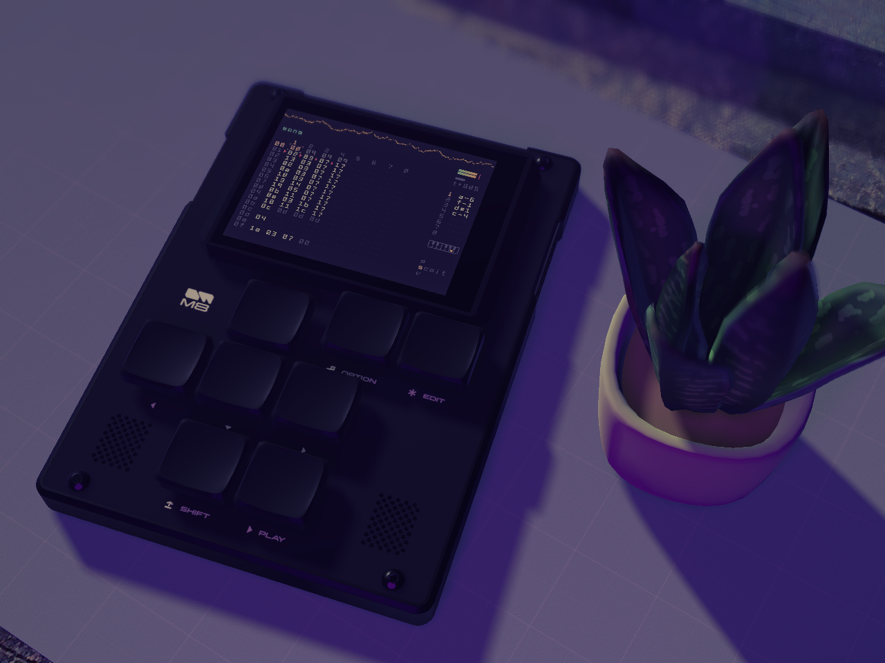

<center>
<h1>
m8gd: M8 Headless Display and Visualizer
</h1>
</center>

**m8gd** is a M8 display client for the M8 Tracker that provides a variety of 3D and 2D scenes.

This repository consists of the C++ library and GDExtension `libm8gd` that allows Godot to connect to M8 devices, and the Godot project `m8gd`.

Table of contents
=================

* [Download](#download)
* [Usage](#usage)
    * [Scenes](#scenes)
    * [Overlays](#overlays)
    * [Filters](#filters)
    * [Controls](#controls)
* [Building](#building)
    * [Requirements](#requirements)
    * [Building From Source](#building-from-source)
* [Troubleshooting](#troubleshooting)
* [Editing](#editing)
* [Credits](#credits)

Download
========

[GitHub Releases (Windows, Linux, & MacOS (x86_64 only))](https://github.com/octoocto/m8gd/releases)

Note that this project is a work-in-progress. All releases are pre-release builds.

Linux builds require the `libserialport` package to be installed.

If you wish to build this project from source, please see [Building](#building).

Usage
=====

## Scenes

The M8 screen can be displayed in various built-in scenes. Scenes are loaded and configured from the main menu.

- **Fast Display**: resembles other M8 display apps such as m8.run and m8c.
- **Fancy Display**: same as the Fast Display with additional customizable settings.
- **Desktop** (3D): resembles a real-world desktop camera setup, including an interactive 3D model of the M8 and some desktop decorations.
- **Floating** (3D): resembles a floating 3D model of the M8 in empty space with a jumbotron showing the M8 display in the background.

## Overlays

Various overlays can be toggled on/off and configured in the main menu.

- **Audio Spectrum**: an audio spectrum (magnitude over frequency) graph.
- **Audio Waveform**: an audio waveform (magnitude over time) graph.
- **M8 Display**: a secondary 2D M8 display panel. Useful for overlaying over 3D scenes.
- **Key Display**: displays live keystrokes and key combos (either from the physical M8 or from m8gd) live.

### M8 Theme Integration

The audio spectrum and audio waveform overlays are able to use colors from your M8's current theme (defaults to white), however, you must enter the Theme screen on the M8 at least once while m8gd is open first.

## Filters

Various filters/shaders can be toggled on/off and configured in the main menu.

- **VHS Shader**: emulates VHS tape effects
- **CRT Shader**: emulates a CRT monitor
- **Noise Filter**: a subtle noise filter. Useful in the Fancy Display scene to avoid gradient banding.

## Controls

### General

Action               | Binding
---------------------|----------
Open/Close Main Menu | ESC
Toggle Fullscreen    | Alt+Enter
Take Screenshot      | F12

### Camera controls (only applicable to 3D scenes)

Action                                                    | Binding
----------------------------------------------------------|-----------------------
Pan camera                                                | Mouse Move
Zoom camera                                               | Hold Mouse Right-Click
Move camera mode (when in camera or scene menu)           | Hold Mouse Right-Click
Move camera (when in "move camera mode")                  | WASD
Adjust camera angle (when in "move camera mode")          | Mouse Move
Adjust camera focal distance (when in "move camera mode") | Mouse Scroll Up/Down

### M8 Key Input

M8 Key | Default Binding (KB)
-------|---------------------
Up     | Up Arrow
Down   | Down Arrow
Left   | Left Arrow
Right  | Right Arrow
Shift  | Shift
Play   | Spacebar
Option | Z
Edit   | X

### M8 Keyjazz / Virtual Keyboard

Action            | Default Binding (KB)
------------------|---------------------
Play Note         | `A` to `'`
Decrease Octave   | `-`
Increase Octave   | `=`
Decrease Velocity | `[`
Increase Velocity | `]`

# Building

## Requirements

- Git
- GCC (if on Windows/Linux) or Clang (if on macOS)
- Homebrew or MacPorts (if on macOS)
- Python 3.6+
- Scons (`python -m pip install scons`)
- pkg-config
- libserialport
- [Godot 4.3-stable](https://godotengine.org/download/archive/4.3-stable/)

If on Windows, a MSYS2/MinGW64 installation is recommended when compiling.

### Installing Requirements

#### Windows (via MinGW64)

```bash
$ pacman -S git pkg-conf python python-pip base-devel mingw-w64-x86_64-gcc mingw-w64-x86_64-libserialport
$ python -m pip install scons
```

#### Linux (Arch Linux)

```bash
$ sudo pacman -S git pkg-conf python python-pip base-devel gcc libserialport
$ python -m pip install scons
```

#### MacOS

```bash
# with Homebrew
$ brew install scons
$ brew install libserialport

# with MacPorts
$ macports install scons
$ macports install libserialport
```

## Building From Source

```bash
$ git clone https://github.com/octoocto/m8gd
$ cd m8gd
$ git submodule update --init
$ python build.py
```

The `build.py` script will automatically download Godot and its export templates in order to export the project if it does not find a `godot` command. To force the script to run without downloading anything, run `python build.py --nodownload` instead.

If the export was successful, a .zip file containing the app should be created in the `build/` folder.

Run `python build.py -h` for different options

# Troubleshooting

## Audio issues

In order to monitor audio, m8gd will attempt to find the audio input device associated with the M8 and listen to it.

### No audio playing

If the device is disabled, or m8gd doesn't have permissions to access the M8's audio input device, then it will fail to connect.
See more details [here](https://docs.godotengine.org/en/4.2/classes/class_projectsettings.html#class-projectsettings-property-audio-driver-enable-input).

m8gd will also detect if the audio device is connected but not playing (this may happen when repeatedly disconnecting/connecting the M8) and automatically attempt to reconnect the audio device. This can happen around 10 seconds of the audio device not playing.

## Running on macOS

At this time, the macOS build included in the releases does not have an official Apple Developer code signature and will likely not start as-is. 

Please read [this guide](https://docs.godotengine.org/en/stable/tutorials/export/running_on_macos.html#app-is-signed-including-ad-hoc-signatures-but-not-notarized) from the Godot docs on how to allow m8gd to run.

The macOS build is also compiled specifically for x86_64 CPUs. If you are on a macOS system with the M1 chip or newer, enabling "Open using Rosetta" in the app's info window is also needed for it to start.

## Running on Steam Deck

On the Steam Deck, installing the `libserialport` package via `pacman` is required to run m8gd. Assuming you've already set up a `sudo` password, run the below commands in Desktop Mode with Konsole to install `libserialport`.

Note: this will temporarily disable read-only mode on the Steam Deck. This also means that `libserialport` will have to be installed again when SteamOS updates.

```sh
$ sudo steamos-readonly disable
$ sudo pacman-key init
$ sudo pacman-key --populate archlinux
$ sudo pacman -S libserialport
$ sudo steamos-readonly enable
```

# Editing

A debug binary of the gdextension `libm8gd` is required to open this project in the Godot editor.

Please follow the build instructions in [Building](#building) (run `python build.py --dev` to compile a debug gdextension) or use a precompiled library from the latest release if available, placed in `project/addons/libm8gd/bin`.

This project has been tested to work on [Godot 4.3-stable](https://godotengine.org/download/archive/4.3-stable/).

# Credits

- Thanks to laamaa for creating [m8c](https://github.com/laamaa/m8c)! This was used as a reference when creating `libm8gd`.
- m8stealth57 and m8stealth89 fonts by Trash80. These fonts were converted to bitmaps.
- [M8 Tracker 3D Model](https://sketchfab.com/3d-models/dirtywave-m8-tracker-05ba530f902e4474b0e01ae2750eec3c) by David Junghanns
- [Prototype Textures](https://kenney-assets.itch.io/prototype-textures) by Kenney
- [Succulent plants model](https://sketchfab.com/3d-models/succulent-plants-ea9a2df2a598410f9f63ba9380795f92) by uniko
- [VHS Post Processing](https://godotshaders.com/shader/vhs-post-processing/) shader by LazarusOverlook
- [VHS with wiggle](https://godotshaders.com/shader/vhs/) shader by cyanone
- [CRT Shader with realistic blurring](https://godotshaders.com/shader/crt-shader-with-realistic-blurring/) shader by Ahopness
- [VHS and CRT monitor effect](godotshaders.com/shader/VHS-and-CRT-monitor-effect) shader by pend00